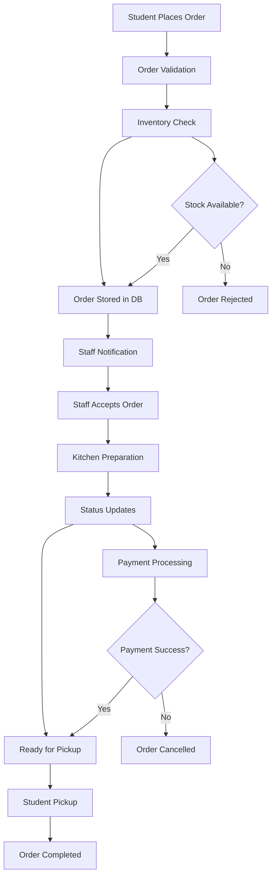

# Canteen Automation System - Technical Requirements Document

## Table of Contents
1. [System Overview](#system-overview)
2. [Authentication & User Roles](#authentication--user-roles)
3. [Client-Side (Student App)](#client-side-student-app)
4. [Canteen Staff Side (Kitchen/Admin App)](#canteen-staff-side-kitchenadmin-app)
5. [Backend & API Requirements](#backend--api-requirements)
6. [Inventory Management](#inventory-management)
7. [Order Flow](#order-flow)
8. [Scalability Considerations](#scalability-considerations)
9. [Payment Gateway Logic](#payment-gateway-logic)
10. [Technical Architecture](#technical-architecture)
11. [Database Schema](#database-schema)
12. [Security Considerations](#security-considerations)
13. [Deployment & DevOps](#deployment--devops)

## System Overview

The Canteen Automation System is a full-stack Next.js application designed to streamline food ordering, payment processing, and kitchen operations for educational institutions. The system supports multiple user roles with real-time updates and scalable architecture.

### Key Features
- **Multi-role authentication** (Students, Staff, Admins)
- **Real-time order management** with WebSocket integration
- **Integrated payment processing** (UPI, Cards, Wallet)
- **Inventory tracking** with auto-stock management
- **Responsive design** for mobile-first experience
- **Scalable architecture** supporting multiple locations

---

## Authentication & User Roles

### User Types & Permissions

#### 1. Students
- **Permissions**: Browse menu, place orders, track orders, view history, manage profile
- **Access Level**: Client-side application only
- **Authentication**: Email/Password, Student ID verification

#### 2. Canteen Staff
- **Permissions**: View orders, update order status, manage inventory, view analytics
- **Access Level**: Staff dashboard with limited admin functions
- **Authentication**: Staff ID + Password, 2FA optional

#### 3. System Administrators
- **Permissions**: Full system access, user management, system configuration
- **Access Level**: Complete admin panel
- **Authentication**: Admin credentials + 2FA mandatory

### Authentication Flow

```typescript
// Authentication Flow Structure
interface AuthFlow {
  login: {
    credentials: string;
    validation: boolean;
    role: 'student' | 'staff' | 'admin';
    session: JWT;
  };
  signup: {
    student: 'email + studentId + verification';
    staff: 'staffId + adminApproval + verification';
    admin: 'adminCredentials + superAdminApproval';
  };
  session: {
    refresh: 'automatic';
    expiry: 'configurable';
    logout: 'immediate';
  };
}
```

### Role-Based Access Control (RBAC)

```typescript
// RBAC Implementation
const rolePermissions = {
  student: ['read:menu', 'create:order', 'read:own_orders', 'update:profile'],
  staff: ['read:orders', 'update:order_status', 'read:inventory', 'update:inventory'],
  admin: ['*'] // Full access
};
```

---

## Client-Side (Student App)

### Core Functionality

#### 1. Menu Browsing
- **Real-time availability** from inventory system
- **Category-based filtering** (Breakfast, Lunch, Snacks, Beverages)
- **Search functionality** with autocomplete
- **Dietary preference indicators** (Veg/Non-veg, Allergen warnings)
- **Price display** with any active discounts

#### 2. Ordering Flow

##### Step 1: Item Selection
```typescript
interface OrderItem {
  itemId: string;
  quantity: number;
  specialInstructions?: string;
  customization?: CustomizationOption[];
}
```

##### Step 2: Cart Management
- **Add/Remove items** with quantity controls
- **Real-time price calculation** including taxes
- **Cart persistence** across browser sessions
- **Maximum order limits** per transaction

##### Step 3: Order Confirmation
- **Order summary** with itemized breakdown
- **Delivery/pickup options** with timing
- **Special instructions** field
- **Terms & conditions** acceptance

##### Step 4: Payment Processing
- **Multiple payment methods**:
  - UPI (QR code + deep linking)
  - Credit/Debit cards
  - Digital wallet integration
  - Campus card integration

#### 3. Order Tracking

##### Status Updates
```typescript
enum OrderStatus {
  PENDING = 'pending',
  CONFIRMED = 'confirmed',
  IN_PROGRESS = 'in_progress',
  READY_FOR_PICKUP = 'ready_for_pickup',
  COMPLETED = 'completed',
  CANCELLED = 'cancelled'
}
```

##### Real-time Notifications
- **Push notifications** for status changes
- **In-app alerts** with sound/vibration
- **Email notifications** for order confirmations
- **SMS alerts** for critical updates

#### 4. Order History
- **Complete order records** with status timeline
- **Re-order functionality** for previous orders
- **Receipt generation** and download
- **Rating and feedback** system

---

## Canteen Staff Side (Kitchen/Admin App)

### Dashboard Overview

#### 1. Order Management Dashboard
```typescript
interface OrderDashboard {
  incomingOrders: Order[];
  activeOrders: Order[];
  completedOrders: Order[];
  orderQueue: OrderQueue;
  realTimeUpdates: boolean;
}
```

#### 2. Order Processing Workflow

##### Order Acceptance
- **View order details** (items, quantities, special instructions)
- **Accept/Reject orders** with reason codes
- **Set estimated preparation time**
- **Assign to specific kitchen station**

##### Status Updates
- **Real-time status progression**:
  - `confirmed` → `in_progress` → `ready_for_pickup` → `completed`
- **Preparation time tracking** with alerts
- **Bulk status updates** for multiple orders

#### 3. Queue Management
- **Priority-based ordering** (VIP, time-sensitive items)
- **Station assignment** (grill, fryer, beverage, etc.)
- **Capacity management** per station
- **Real-time queue visualization**

#### 4. Inventory Management
- **Stock level monitoring** with low-stock alerts
- **Quick stock updates** for daily operations
- **Item availability toggle** (enable/disable items)
- **Stock consumption tracking** per order

---

## Backend & API Requirements

### Technology Stack

#### Frontend
- **Next.js 14+** with App Router
- **TypeScript** for type safety
- **Tailwind CSS** for styling
- **React Query/TanStack Query** for state management
- **Zustand** for global state

#### Backend
- **Next.js API Routes** or **Express.js** standalone
- **Node.js** runtime
- **TypeScript** backend
- **Prisma** ORM for database operations

#### Real-time Communication
- **WebSocket** (Socket.io) for live updates
- **Server-Sent Events** as fallback
- **Polling** for legacy support

### API Architecture

#### RESTful Endpoints
```typescript
// Core API Structure
const apiEndpoints = {
  // Authentication
  'POST /api/auth/login': 'User authentication',
  'POST /api/auth/signup': 'User registration',
  'POST /api/auth/logout': 'Session termination',
  
  // Menu & Inventory
  'GET /api/menu': 'Retrieve menu items',
  'GET /api/menu/:id': 'Get specific menu item',
  'PUT /api/menu/:id': 'Update menu item (admin)',
  
  // Orders
  'POST /api/orders': 'Create new order',
  'GET /api/orders': 'Get user orders',
  'PUT /api/orders/:id/status': 'Update order status',
  
  // Payments
  'POST /api/payments/initiate': 'Start payment process',
  'POST /api/payments/callback': 'Payment gateway callback',
  'GET /api/payments/:orderId': 'Get payment status'
};
```

#### WebSocket Events
```typescript
// Real-time Event Types
interface WebSocketEvents {
  // Order Updates
  'order:created': Order;
  'order:status_updated': { orderId: string; status: OrderStatus };
  'order:ready': { orderId: string; pickupLocation: string };
  
  // Inventory Updates
  'inventory:low_stock': InventoryItem[];
  'inventory:item_unavailable': string;
  
  // System Notifications
  'notification:new': Notification;
  'system:maintenance': MaintenanceAlert;
}
```

---

## Inventory Management

### Core Features

#### 1. Item Management
```typescript
interface InventoryItem {
  id: string;
  name: string;
  category: string;
  price: number;
  cost: number;
  stockQuantity: number;
  minStockLevel: number;
  maxStockLevel: number;
  isAvailable: boolean;
  allergens: string[];
  dietaryInfo: DietaryInfo;
  imageUrl: string;
  description: string;
  preparationTime: number; // in minutes
}
```

#### 2. Stock Operations
- **Daily stock updates** with batch processing
- **Automatic stock deduction** on order confirmation
- **Low stock alerts** with configurable thresholds
- **Stock forecasting** based on historical data

#### 3. Availability Management
- **Auto-disable items** when stock reaches zero
- **Temporary unavailability** for maintenance
- **Scheduled availability** (time-based menu items)
- **Location-based availability** for multi-location support

---

## Order Flow

### Complete Order Lifecycle



### Order Processing Rules

#### 1. Validation Rules
- **Minimum order amount** enforcement
- **Maximum order quantity** per item
- **Operating hours** validation
- **Payment method** availability check

#### 2. Business Logic
- **Order queuing** based on preparation time
- **Priority handling** for special orders
- **Cancellation policies** with time limits
- **Refund processing** for failed payments

---

## Scalability Considerations

### Architecture Scaling

#### 1. Multi-Location Support
```typescript
interface Location {
  id: string;
  name: string;
  address: string;
  coordinates: { lat: number; lng: number };
  operatingHours: OperatingHours;
  kitchenStations: KitchenStation[];
  maxConcurrentOrders: number;
}
```

#### 2. Performance Optimization
- **Redis caching** for frequently accessed data
- **CDN integration** for static assets
- **Database indexing** for query optimization
- **Load balancing** for high traffic scenarios

#### 3. Modular Design
- **Plugin architecture** for future features
- **Microservices** ready for complex deployments
- **API versioning** for backward compatibility
- **Feature flags** for gradual rollouts

### Future Feature Integration

#### 1. Loyalty System
- **Points accumulation** and redemption
- **Tier-based benefits** (Bronze, Silver, Gold)
- **Referral rewards** and incentives

#### 2. Analytics & Reporting
- **Sales analytics** with real-time dashboards
- **Customer behavior** insights
- **Inventory optimization** recommendations
- **Performance metrics** for staff

---

## Payment Gateway Logic

### Payment Flow Architecture

#### 1. Payment Initiation
```typescript
interface PaymentRequest {
  orderId: string;
  amount: number;
  currency: string;
  paymentMethod: PaymentMethod;
  customerDetails: CustomerInfo;
  callbackUrl: string;
  metadata: Record<string, any>;
}
```

#### 2. Gateway Integration
- **Multiple gateway support** (Razorpay, Stripe, PayU)
- **UPI deep linking** for mobile payments
- **QR code generation** for UPI payments
- **Card payment** with 3D Secure

#### 3. Payment Processing
```typescript
// Payment Status Flow
enum PaymentStatus {
  INITIATED = 'initiated',
  PROCESSING = 'processing',
  SUCCESS = 'success',
  FAILED = 'failed',
  CANCELLED = 'cancelled',
  REFUNDED = 'refunded'
}
```

#### 4. Callback Handling
- **Webhook verification** for security
- **Order status updates** based on payment
- **Automatic order cancellation** on payment failure
- **Transaction logging** for audit trails

---

## Technical Architecture

### System Architecture Diagram

```
┌─────────────────┐    ┌─────────────────┐    ┌─────────────────┐
│   Student App   │    │   Staff App     │    │   Admin Panel   │
│   (Next.js)     │    │   (Next.js)     │    │   (Next.js)     │
└─────────┬───────┘    └─────────┬───────┘    └─────────┬───────┘
          │                      │                      │
          └──────────────────────┼──────────────────────┘
                                 │
                    ┌─────────────┴─────────────┐
                    │      Next.js API          │
                    │      (Backend)            │
                    └─────────────┬─────────────┘
                                 │
          ┌───────────────────────┼───────────────────────┐
          │                       │                       │
┌─────────┴─────────┐  ┌─────────┴─────────┐  ┌─────────┴─────────┐
│   WebSocket       │  │   Payment         │  │   File Storage    │
│   Server          │  │   Gateway         │  │   (AWS S3)        │
└───────────────────┘  └───────────────────┘  └───────────────────┘
          │                       │                       │
          └───────────────────────┼───────────────────────┘
                                 │
                    ┌─────────────┴─────────────┐
                    │      Database             │
                    │   (PostgreSQL + Redis)   │
                    └───────────────────────────┘
```

### Technology Stack Details

#### Frontend Technologies
- **Next.js 14+** with App Router for SSR/SSG
- **TypeScript** for type safety and better DX
- **Tailwind CSS** for utility-first styling
- **Framer Motion** for smooth animations
- **React Hook Form** for form management
- **Zod** for schema validation

#### Backend Technologies
- **Next.js API Routes** for backend functionality
- **Prisma** as ORM with PostgreSQL
- **Redis** for caching and session management
- **Socket.io** for real-time communication
- **JWT** for authentication
- **bcrypt** for password hashing

#### Database & Storage
- **PostgreSQL** as primary database
- **Redis** for caching and real-time data
- **AWS S3** for file storage (images, documents)
- **Prisma Migrate** for database migrations

---

## Database Schema

### Core Tables

#### 1. Users Table
```sql
CREATE TABLE users (
  id UUID PRIMARY KEY DEFAULT gen_random_uuid(),
  email VARCHAR(255) UNIQUE NOT NULL,
  password_hash VARCHAR(255) NOT NULL,
  role USER_ROLE NOT NULL DEFAULT 'student',
  student_id VARCHAR(50) UNIQUE,
  staff_id VARCHAR(50) UNIQUE,
  first_name VARCHAR(100) NOT NULL,
  last_name VARCHAR(100) NOT NULL,
  phone VARCHAR(20),
  is_active BOOLEAN DEFAULT true,
  created_at TIMESTAMP DEFAULT CURRENT_TIMESTAMP,
  updated_at TIMESTAMP DEFAULT CURRENT_TIMESTAMP
);

CREATE TYPE USER_ROLE AS ENUM ('student', 'staff', 'admin');
```

#### 2. Menu Items Table
```sql
CREATE TABLE menu_items (
  id UUID PRIMARY KEY DEFAULT gen_random_uuid(),
  name VARCHAR(255) NOT NULL,
  description TEXT,
  price DECIMAL(10,2) NOT NULL,
  cost DECIMAL(10,2) NOT NULL,
  category_id UUID REFERENCES categories(id),
  stock_quantity INTEGER DEFAULT 0,
  min_stock_level INTEGER DEFAULT 5,
  is_available BOOLEAN DEFAULT true,
  preparation_time INTEGER DEFAULT 15,
  image_url VARCHAR(500),
  allergens TEXT[],
  dietary_info JSONB,
  created_at TIMESTAMP DEFAULT CURRENT_TIMESTAMP,
  updated_at TIMESTAMP DEFAULT CURRENT_TIMESTAMP
);
```

#### 3. Orders Table
```sql
CREATE TABLE orders (
  id UUID PRIMARY KEY DEFAULT gen_random_uuid(),
  user_id UUID REFERENCES users(id),
  order_number VARCHAR(50) UNIQUE NOT NULL,
  status ORDER_STATUS DEFAULT 'pending',
  total_amount DECIMAL(10,2) NOT NULL,
  payment_status PAYMENT_STATUS DEFAULT 'pending',
  payment_method PAYMENT_METHOD,
  special_instructions TEXT,
  pickup_location VARCHAR(100),
  estimated_pickup_time TIMESTAMP,
  created_at TIMESTAMP DEFAULT CURRENT_TIMESTAMP,
  updated_at TIMESTAMP DEFAULT CURRENT_TIMESTAMP
);

CREATE TYPE ORDER_STATUS AS ENUM (
  'pending', 'confirmed', 'in_progress', 
  'ready_for_pickup', 'completed', 'cancelled'
);

CREATE TYPE PAYMENT_STATUS AS ENUM (
  'pending', 'processing', 'success', 'failed', 'cancelled', 'refunded'
);

CREATE TYPE PAYMENT_METHOD AS ENUM ('upi', 'card', 'wallet', 'campus_card');
```

#### 4. Order Items Table
```sql
CREATE TABLE order_items (
  id UUID PRIMARY KEY DEFAULT gen_random_uuid(),
  order_id UUID REFERENCES orders(id),
  menu_item_id UUID REFERENCES menu_items(id),
  quantity INTEGER NOT NULL,
  unit_price DECIMAL(10,2) NOT NULL,
  total_price DECIMAL(10,2) NOT NULL,
  special_instructions TEXT,
  created_at TIMESTAMP DEFAULT CURRENT_TIMESTAMP
);
```

#### 5. Transactions Table
```sql
CREATE TABLE transactions (
  id UUID PRIMARY KEY DEFAULT gen_random_uuid(),
  order_id UUID REFERENCES orders(id),
  payment_gateway VARCHAR(100) NOT NULL,
  gateway_transaction_id VARCHAR(255),
  amount DECIMAL(10,2) NOT NULL,
  currency VARCHAR(3) DEFAULT 'INR',
  status PAYMENT_STATUS NOT NULL,
  gateway_response JSONB,
  created_at TIMESTAMP DEFAULT CURRENT_TIMESTAMP
);
```

---

## Security Considerations

### Authentication Security
- **JWT token expiration** with refresh mechanism
- **Password complexity requirements** and hashing
- **Rate limiting** for login attempts
- **Session management** with secure cookies

### Data Security
- **Input validation** and sanitization
- **SQL injection prevention** with Prisma ORM
- **XSS protection** with Content Security Policy
- **CSRF protection** for form submissions

### API Security
- **CORS configuration** for cross-origin requests
- **API rate limiting** per user/IP
- **Request validation** with Zod schemas
- **HTTPS enforcement** in production

---

## Deployment & DevOps

### Environment Configuration
```typescript
// Environment Variables
interface EnvironmentConfig {
  // Database
  DATABASE_URL: string;
  REDIS_URL: string;
  
  // Authentication
  JWT_SECRET: string;
  JWT_EXPIRES_IN: string;
  
  // Payment Gateway
  RAZORPAY_KEY_ID: string;
  RAZORPAY_KEY_SECRET: string;
  
  // File Storage
  AWS_ACCESS_KEY_ID: string;
  AWS_SECRET_ACCESS_KEY: string;
  AWS_S3_BUCKET: string;
  
  // External Services
  SMTP_HOST: string;
  SMTP_PORT: number;
  SMTP_USER: string;
  SMTP_PASS: string;
}
```

### Deployment Strategy
- **Docker containerization** for consistent environments
- **CI/CD pipeline** with GitHub Actions
- **Environment-specific configurations** (dev, staging, prod)
- **Database migrations** with Prisma
- **Health checks** and monitoring

### Monitoring & Logging
- **Application performance monitoring** (APM)
- **Error tracking** with Sentry
- **Log aggregation** and analysis
- **Uptime monitoring** and alerting
- **Database performance** monitoring

---

## Implementation Timeline

### Phase 1: Core Infrastructure (Weeks 1-4)
- [ ] Project setup and configuration
- [ ] Database schema design and implementation
- [ ] Authentication system
- [ ] Basic API structure

### Phase 2: Student App (Weeks 5-8)
- [ ] Menu browsing interface
- [ ] Order placement system
- [ ] Basic order tracking
- [ ] User profile management

### Phase 3: Staff App (Weeks 9-12)
- [ ] Order management dashboard
- [ ] Status update functionality
- [ ] Basic inventory management
- [ ] Real-time notifications

### Phase 4: Payment Integration (Weeks 13-16)
- [ ] Payment gateway setup
- [ ] Order-payment flow
- [ ] Transaction management
- [ ] Payment status updates

### Phase 5: Advanced Features (Weeks 17-20)
- [ ] Real-time WebSocket integration
- [ ] Advanced inventory management
- [ ] Analytics and reporting
- [ ] Performance optimization

### Phase 6: Testing & Deployment (Weeks 21-24)
- [ ] Comprehensive testing
- [ ] Security audit
- [ ] Production deployment
- [ ] User training and documentation

---

## Conclusion

This technical requirements document provides a comprehensive foundation for building a scalable canteen automation system. The architecture is designed to support current needs while maintaining flexibility for future enhancements. The modular approach ensures that new features can be integrated seamlessly without disrupting existing functionality.

### Key Success Factors
1. **Real-time communication** for seamless order tracking
2. **Robust payment processing** with proper error handling
3. **Scalable database design** supporting multiple locations
4. **Security-first approach** protecting user data and transactions
5. **Mobile-responsive design** for optimal user experience

### Next Steps
1. **Review and approve** technical requirements
2. **Set up development environment** and project structure
3. **Begin Phase 1** implementation
4. **Regular stakeholder reviews** throughout development
5. **Continuous testing** and quality assurance

---

*Document Version: 1.0*  
*Last Updated: [Current Date]*  
*Prepared by: Development Team*  
*Approved by: [Stakeholder Name]*
